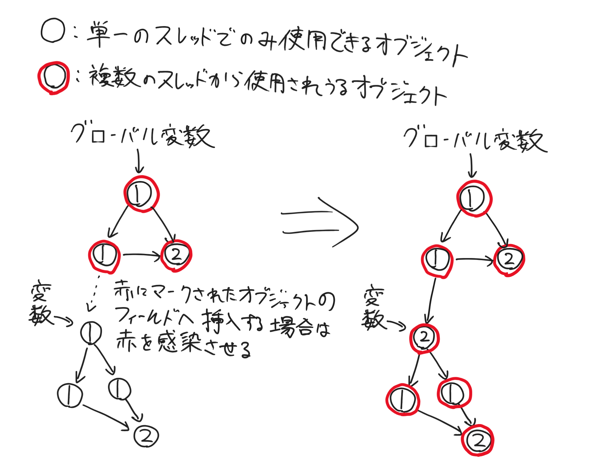
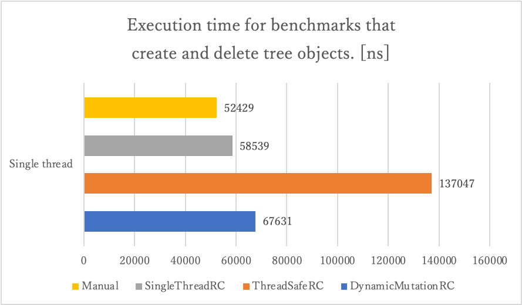

<div align="center">
<h2>Dynamic Mutation Reference Counting</h2>
<p>並行即時参照カウントの同期コストを抑制するためのアルゴリズム</p>
</div>

[開発中のプログラミング言語(Catla)](https://github.com/bea4dev/catla)で使用している軽量かつスレッドセーフな即時参照カウントアルゴリズム

通常、スレッドセーフな即時参照カウントはカウントの増減や複数のスレッドへ所有権を共有するタイミングで適切な同期処理を要する。
この同期処理は、ほとんどの場合にそれぞれ適切な atomic-read-modify-write や排他制御を必要とし[^1]、これが頻繁に発生する場合は
無視できないほどのオーバーヘッドとなる(特にx86系プロセッサ)。

このアルゴリズムはこの問題に対処するため、オブジェクトが複数のスレッドからアクセスされうるかどうかを判定し、
動的にシングルスレッド専用の参照カウントとスレッドセーフな参照カウントを切り替えて動作することで余計な同期コストを削減する。

アルゴリズムの詳細は[src/dynamic_rc.hpp](https://github.com/bea4dev/DynamicMutationReferenceCounting/blob/main/src/dynamic_rc.hpp)に記述されている。

[^1]: スレッドセーフな参照カウントは『ガベージコレクション 自動的メモリ管理を構成する理論と実装』の18章「並行参照カウント法」にて取り上げられている、ロックを用いた単純な並行即時参照カウント法を参考に実装している

> #### 直感的な説明
> 
> 図のように赤を感染させ、オブジェクトが赤の場合は複数のスレッドからアクセスされるものと考えスレッドセーフな参照カウントを用いて管理し、
> そうでない場合は単一のスレッドからしかアクセスされないものとして考えシングルスレッド専用の参照カウントで管理する。

> #### ベンチマーク(参考)
> シングルスレッドで、ある程度深さのある木構造を作成して削除するベンチマークである。
> 順に 手動メモリ管理, シングルスレッド専用の参照カウント, スレッドセーフな参照カウント, 動的変異参照カウント(このアルゴリズム) の測定結果(10回計測の平均)である。
> ただし、これは簡易的なトイベンチマークであるため参考程度にしかならないことに留意していただきたい。
> 使用したベンチマークプログラムはこの章以降を参照のこと。
> 

## テストプログラムのビルド方法
ビルドには g++ or clang++, cmake, git が必要です。

1. https://github.com/google/benchmark のプロジェクトをビルドしてインストールします。
下記の手順は上記サイトの引用です。
```bash
# Check out the library.
$ git clone https://github.com/google/benchmark.git
# Go to the library root directory
$ cd benchmark
# Make a build directory to place the build output.
$ cmake -E make_directory "build"
# Generate build system files with cmake, and download any dependencies.
$ cmake -E chdir "build" cmake -DBENCHMARK_DOWNLOAD_DEPENDENCIES=on -DCMAKE_BUILD_TYPE=Release ../
# or, starting with CMake 3.13, use a simpler form:
# cmake -DCMAKE_BUILD_TYPE=Release -S . -B "build"
# Build the library.
$ cmake --build "build" --config Release

# Install
$ sudo cmake --build "build" --config Release --target install
```
2. このプロジェクトを clone してビルドします。
```bash
# Clone this project.
$ git clone https://github.com/bea4dev/DynamicMutationReferenceCounting.git
# Go to the project root.
$ cd DynamicMutationReferenceCounting
# Build this project.
$ cmake -S . -B build
$ cmake --build build
```
3. 実行
```bash
$ ./build/dynamic_rc_benchmark
```